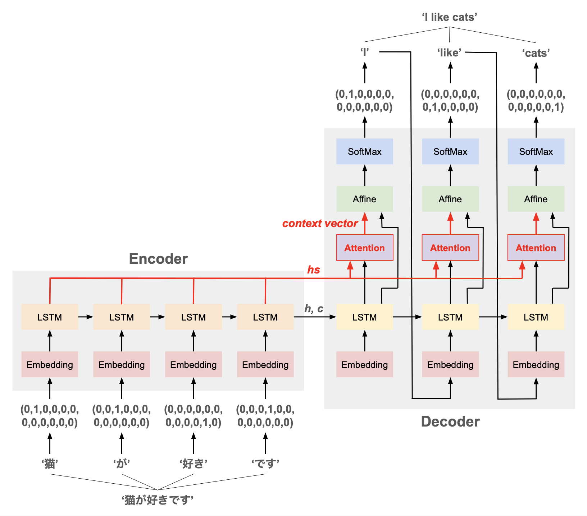
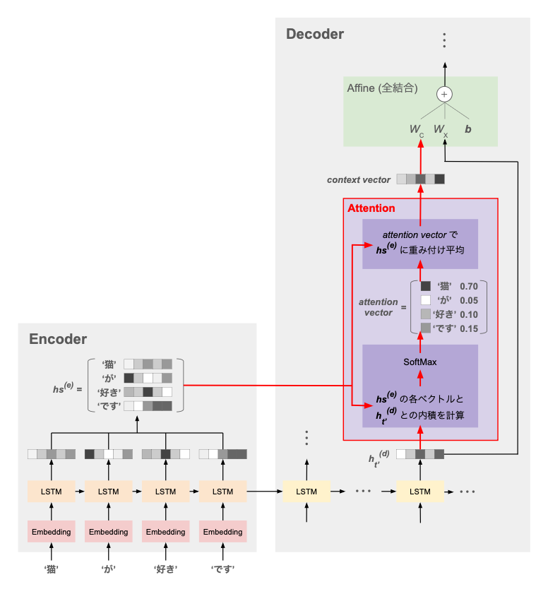
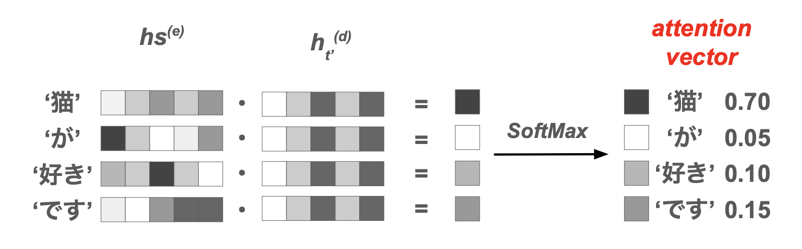
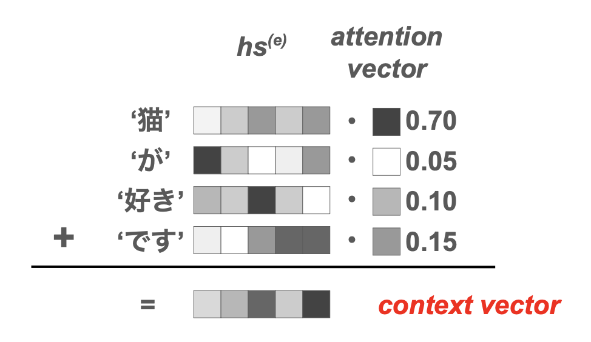

# Attention とは

**注意機構** とも。

ニューラルネットワークにおいて、データの個々の値に重みをつけることで，データ間の関係性や重要性をより明確に捉えるメカニズム。  
与えられた情報の一部分に注意を向け、強弱の重みを付けて取り扱うことができる。

- [CNN](cnn.md) や [RNN](rnn.md) に Attention を導入
- Transformer のような完全に Attention ベースのモデルを構築

といった利用方法がある。

# 概観

ここでは、[LSTM](lstm.md) による [seq2seq](seq2seq.md) ネットワークに Attention を導入する例を示す。

ネットワーク全体像：



Attention 層の詳細：



ポイント：シンプルな [seq2seq](seq2seq.md) のネットワークに対して、Encoder の全出力 $hs^{(e)} = \left\{\boldsymbol{h}_1^{(e)}, \cdots, \boldsymbol{h}_T^{(e)}\right\}$ と Decoder のある時刻の LSTM 出力 $\boldsymbol{h}_{t'}^{(d)}$ を受け取る Attention 層が追加される。  
そして、この層の出力も全結合層に入力として与える構造となっている。

Attention 層では、Encoder の全情報（各 LSTM の出力 $\boldsymbol{h}_1^{(e)}, \cdots, \boldsymbol{h}_T^{(e)}$）のうち、「そのときの文脈（= Decoder の LSTM 出力 $\boldsymbol{h}_{t'}^{(d)}$）にとって重要な情報」を判断・取捨選択して重み付けし、context vector $\boldsymbol{c}_{t'}$ として抽出する。


## attention vector の計算



前段の処理では、Encoder の各 LSTM の出力 $hs^{(e)} = \left\{\boldsymbol{h}_1^{(e)}, \cdots, \boldsymbol{h}_T^{(e)}\right\}$ と、Decoder の $t'$ 番目の LSTM の出力 $\boldsymbol{h}_{t'}^{(d)}$ の内積を計算する。

$$
a_{t,t'} := \boldsymbol{h}_t^{(e)} \cdot \boldsymbol{h}_{t'}^{(d)}
$$

この内積は、**「Encoder が読み込んだ $t$ 番目の単語と Decoder が出力する $t'$ 番目の単語の類似度・関係の深さ」** と考えることができる。

したがって、これを並べたベクトル

$$
\boldsymbol{a}_{t'} := (a_{1,t'}, \cdots, a_{T,t'})
= \left( \boldsymbol{h}_1^{(e)} \cdot\boldsymbol{h}_{t'}^{(d)}, \quad \cdots \quad , \boldsymbol{h}_T^{(e)} \cdot \boldsymbol{h}_{t'}^{(d)} \right)
$$

は、Decoder の $t'$ 番目の出力が、Encoder が読み込んだ各単語とどの程度近いか、の重みと考えられる。

→ 入力単語 $\boldsymbol{h}_{t}^{(e)}$ と出力単語 $\boldsymbol{h}_{t'}^{(d)}$ との対応付け（アライメント）を自動でやってくれるイメージ

実際の計算では、SoftMax を通して成分の合計が1となるように調整し、後段で行う重み付き平均の重みに使う：

$$
\boldsymbol{a}_{t'} := SoftMax \left( \boldsymbol{h}_1^{(e)} \cdot \boldsymbol{h}_{t'}^{(d)},\quad \cdots,\quad \boldsymbol{h}_T^{(e)} \cdot \boldsymbol{h}_{t'}^{(d)} \right)
$$


## context vector の計算



前節で計算した attention vector により、Decoder の $t'$ 番目の単語にとって Encoder の各単語がどの程度近いかの重みが分かっている。

これを $\boldsymbol{h}_1^{(e)}, \cdots, \boldsymbol{h}_T^{(e)}$ にかけて重み付き平均を取ることで、Attention 層の出力である context vector を得る：

$$
\boldsymbol{c}_{t'} := \sum_t a_{t,t'} \boldsymbol{h}_{t}^{(e)}
$$


# 実装・動作確認

## コード



一般の Decoder の代わりに、ここで定義した `AttentionDecoder` を使うように seq2seq モデルを書き換える。

https://gist.github.com/hkawabata/4cb2cf166087d3be06ea3aa232dca45d#file-model-seq2seq-py

```python
class Seq2Seq:
    def __init__(self, ...):
        ...
        #self.decoder = Decoder(embed, H_rnn, self.T_out)
        self.decoder = AttentionDecoder(embed, H_rnn, self.T_out)
        ...
```
