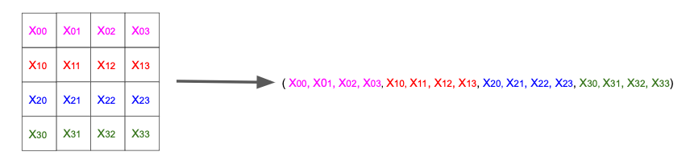
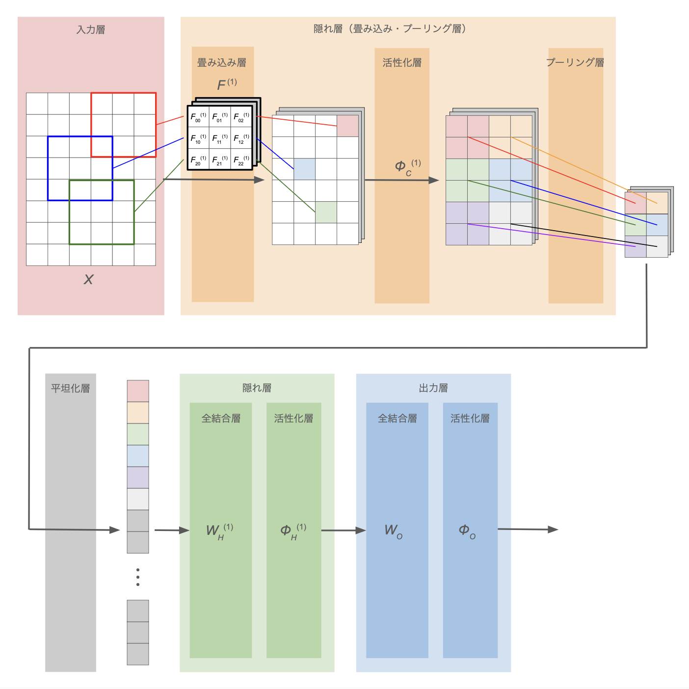
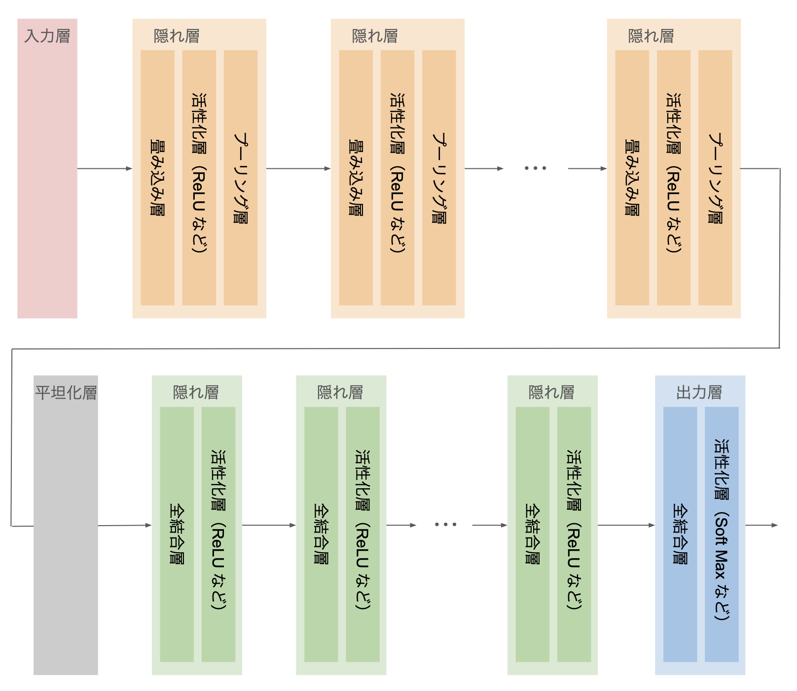
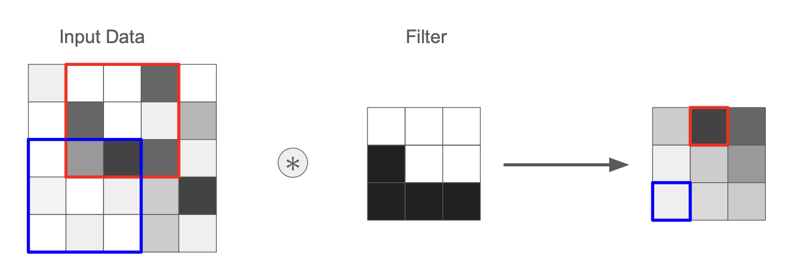
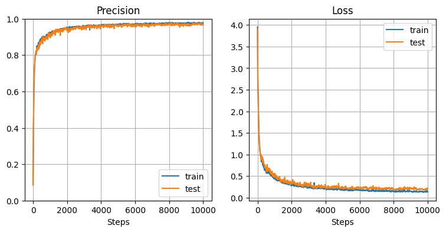

> **【NOTE】注意**
> 
> 本ノートは [MLP（多層パーセプトロン）](mlp.md)の内容を前提として記述する。

# CNN とは

CNN = Convolutional Neural Network

画像認識や映像解析などの分野で高い性能を発揮するニューラルネットワークの1種。

単純な MLP（多層パーセプトロン）では、データは1次元のベクトルとして扱うため、縦横の並びなどデータの形状・位置関係が無視されてしまい、画像処理などにおいて大きな問題となる。  
CNN を用いることで、これらの情報を失わずニューラルネットワークをトレーニングできる。

> **【NOTE】**
> 
> 例えば、$4\times 4$ ピクセルのモノクロ画像データを考える。  
「各ピクセルの値」は要素を $4\times4=16$ 個持つベクトルとして表現できるが、これを1次元ベクトルにすると下図のようになり、例えば「$x_{11}$ と $x_{21}$ は隣接している」という情報が失われてしまう。
> 
> 


# 概観

下図に CNN の概観を示す。



| 処理層        | 説明                                |
| :--------- | :-------------------------------- |
| **入力層**    | [MLP（多層パーセプトロン）](mlp.md)を参照       |
| **出力層**    | [MLP（多層パーセプトロン）](mlp.md)を参照       |
| **隠れ層**    | [MLP（多層パーセプトロン）](mlp.md)を参照       |
| **全結合層**   | [MLP（多層パーセプトロン）](mlp.md)を参照       |
| **活性化層**   | [MLP（多層パーセプトロン）](mlp.md)を参照       |
| **畳み込み層**  | 多次元データの局所的なパターンや特徴を抽出             |
| **プーリング層** | 最大値や平均値などの代表値を用いて、多次元データの空間サイズを縮小 |
| **平坦化層**   | 多次元データを1次元に変換。flatten 処理          |

※ 入力層・出力層・隠れ層（全結合層・活性化層）については [MLP（多層パーセプトロン）](mlp.md)を参照

- 出力層では、多層パーセプトロンと同様、全結合+活性化関数を適用
- 出力層に近いところでも、全結合+活性化関数の隠れ層を利用
    - →（メモ）前段の畳み込み層+プーリング層で位置関係も含めた中間特徴量を抽出し、後段の多層パーセプトロンで特徴量同士の相互関係を学習している？


必要に応じて、畳み込み・プーリング層も全結合の隠れ層もそれぞれ複数組み込んで深いモデルを構築できる：




# 畳み込み層の処理

畳み込み層では、**多次元データの局所的なパターンや特徴を抽出する**。

## 具体的な処理

画像データのように、縦横など複数の方向を持つ多次元データに対して **フィルタ**（**カーネル** とも呼ぶ）による **積和計算** を行う。

下図は $4\times 4$ 次元のデータに対してサイズ $3\times 3$ のフィルタを適用する例で、元データとフィルタの重なり部分に対して、要素同士の積を計算した後に和を取っている。


ここで、**フィルタはデータの局所的なパターン・特徴** を表す。  
元データにフィルタと同じパターンがある部分との積和計算では値が大きくなる。逆に、パターンがない部分との積和計算では値が小さくなる。

下図は、入力データから L 字型のパターンを探すフィルタの例（黒が濃いほど値が大きい）：



このフィルタの値も CNN の学習対象のパラメータであり、「どのようなパターンを抽出すれば良い特徴量となるか？」を学習していく。


## パディング (Padding)

多次元データの周囲を固定の値（0など）で埋める処理。  
主に、**出力データサイズの調整** を目的として行われる。

前節の例では、$4\times 4$ 次元データに対して $3\times 3$ のフィルタを適用した結果、出力データは $2\times 2$ に縮小する。  
このように、パディングがない状態で畳み込み処理を行うと出力サイズは元データよりも小さくなる。これは特に、畳み込み層を何度も適用するディープなニューラルネットワークにおいて問題となる。

前節の例に対して padding = 1 を適用した例を下図に示す。
パディングの結果、出力サイズが元と同じ $4\times 4$ に保たれている。


## ストライド (Stride)

フィルタを適用する位置の間隔（フィルタを動かす飛び幅）を指定するパラメータ。  
これまでの例は stride = 1（飛ばさず1つずつフィルタをずらす）だったが、ストライドを2以上にすることで、**出力の空間サイズを調整し、計算量を減らしつつ特徴抽出を行う** ことができる。

$5\times 5$ 次元データに対して stride = 2 で $3\times 3$ フィルタを適用する例を下図に示す。


## 各パラメータと出力サイズの関係

入力データとして画像のような縦横があるデータを想定し、

- 入力データのサイズ：$H \times W$ ($H$：Hight、$W$：Width)
- 入力に適用する畳み込みフィルタのサイズ：$FH \times FW$
- padding = $P$
- stride = $S$

とする。これに対して出力データのサイズ $OH \times OW$ は、

$$
\begin{eqnarray}
    OH &=& \cfrac{H + 2P - FH}{S} + 1
    \\
    OW &=& \cfrac{W + 2P - FW}{S} + 1
\end{eqnarray}
\tag{1}
$$

と計算できる。


> **【NOTE】**
> 
> $(1)$ 式の分数部分が割り切れるようにパラメータを設定する、あるいはそうなるようにあらかじめ画像データを前処理して端数部分を丸めておかないと、プログラムがエラーになったり、境界付近の情報が消失するおそれがある。


## コスト関数の勾配の導出

入力として縦横の2次元データを想定する。  
誤差逆伝播の計算のため、コスト関数 $J$ の勾配を求める。  
説明が煩雑になるので、以後は特定の特徴量1つに絞って解説。

### 入力変数

| 変数  | 説明                                                    |
| :-- | :---------------------------------------------------- |
| $X$ | 前層の出力に padding = $P$ を施したもの。 $(H+2P)\times (W+2P)$ 行列 |
| $F$ | $X$ に適用するフィルタ。$H_F \times W_F$ 行列                     |
| $b$ | バイアス項（特徴量ごとに1つの値）                                     |

また、stride = $S$ とする。

### 出力変数

入力データ $X$ とフィルタ $F$ との積和計算を定式化すると、出力行列 $Z$ の成分は下式で計算できる：

$$
Z_{ij} := \displaystyle \sum_{k=0}^{H_F-1} \sum_{l=0}^{W_F-1} X_{k+iS,l+jS} F_{kl} + b
\tag{2}
$$

ここで、行列 $X, F$ の添字は $0$ から始まるものとしている。


### コスト関数の勾配

$X_{ij}, F_{ij}$ はそれぞれ独立な変数とみなせるから、$(2)$ 式より

$$
\begin{eqnarray}
    \cfrac{\partial Z_{ij}}{\partial X_{mn}}
    &=&
    \displaystyle \sum_{k=0}^{H_F-1} \sum_{l=0}^{W_F-1} \delta_{k+iS,m} \delta_{l+jS,n} F_{kl}
    \quad
    \left( \because \cfrac{\partial X_{kl}}{\partial X_{mn}} = \delta_{k,m} \delta_{l,n} \right)
    \\ &=&
    \begin{cases}
        F_{m-iS, n-jS} & \mathrm{if}\ \ 0 \le m-iS \lt H_F\ \ \mathrm{and}\ \ 0 \le n-jS \lt W_F \\
        0 & \mathrm{if\ else}
    \end{cases}
    \\
    \cfrac{\partial Z_{ij}}{\partial F_{mn}}
    &=&
    \displaystyle \sum_{k=0}^{H_F-1} \sum_{l=0}^{W_F-1} \delta_{k,m} \delta_{l,n} X_{k+iS,l+jS}
    \quad
    \left( \because \cfrac{\partial F_{kl}}{\partial F_{mn}} = \delta_{k,m} \delta_{l,n} \right)
    \\ &=&
    X_{m+iS, n+jS}
    \\
    \cfrac{\partial Z_{ij}}{\partial b} &=& 1
\end{eqnarray}
$$

よって

$$
\begin{eqnarray}
    \cfrac{\partial J}{\partial X_{ij}}
    &=& \displaystyle \sum_k \sum_l \cfrac{\partial J}{\partial Z_{kl}} \cfrac{\partial Z_{kl}}{\partial X_{ij}}
    \\ &=& \displaystyle
    \sum_{k \in \{k:0\le i-kS \lt H_F\}} \ 
    \sum_{l \in \{l:0\le j-lS \lt W_F\}}
    \cfrac{\partial J}{\partial Z_{kl}} F_{i-kS, j-lS}
    \\
    \cfrac{\partial J}{\partial F_{ij}}
    &=& \displaystyle \sum_k \sum_l \cfrac{\partial J}{\partial Z_{kl}} \cfrac{\partial Z_{kl}}{\partial F_{ij}}
    \\ &=& \displaystyle \sum_k \sum_l \cfrac{\partial J}{\partial Z_{kl}} X_{i+kS, j+lS}
    \\
    \cfrac{\partial J}{\partial b}
    &=& \displaystyle \sum_k \sum_l \cfrac{\partial J}{\partial Z_{kl}} \cfrac{\partial Z_{kl}}{\partial b}
    \\ &=&
    \displaystyle \sum_k \sum_l \cfrac{\partial J}{\partial Z_{kl}}
\end{eqnarray}
$$


# プーリング層の処理

プーリング層では、最大値や平均値などの代表値を用いて、多次元データの空間サイズを小さくする演算を行う。


- 単に最大値や平均値を取るだけなので、**学習するモデルパラメータは存在しない**
- **微小な位置変化に対してロバスト** = 位置変化が起こっても出力が変わりにくい

| 手法              | 説明                | 特徴                                                                                   |
| :-------------- | ----------------- | ------------------------------------------------------------------------------------ |
| Max Pooling     | プーリング領域内の最大値のみを取得 | 領域に「**そのパターンが存在するかどうか**」に敏感であり、エッジや模様など「局所的に強い特徴量」を抽出しやすい                            |
| Average Pooling | プーリング領域内の平均値を計算   | **滑らかな特徴量**が得られ、ノイズを減らす効果がある。Max Pooling よりも情報が均等に残る一方で、局所的な強い特徴が平準化されてしまい、見逃す可能性もある |


## コスト関数の勾配の導出

これまでと同様、入力としては縦横の2次元データを想定し、説明の簡単のため、特定の特徴量1つに絞って議論する。

### 入力変数

| 変数  | 説明                |
| :-- | :---------------- |
| $X$ | $H\times W$ 行列    |

また、プーリングのウインドウサイズを $H_P \times W_P$ とする。


### 出力変数

それぞれのプーリングの方式通りに最大値・平均値を計算して、

$$
\begin{eqnarray}
    Z_{ij} &:=& \displaystyle \max_{iH_P\le k \lt iH_P+H,\ jW_P\le l \lt jW_P+W}{X_{kl}}
    \quad &\mathrm{(Max\ Pooling)}
    \\ \\
    Z_{ij} &:=& \cfrac{
        \sum_{k=iH_P}^{iH_P+H-1}
        \sum_{l=iW_P}^{iW_P+W-1}
        X_{kl}
    }{H_P W_P}
    \quad &\mathrm{(Average\ Pooling)}
\end{eqnarray}
\tag{3}
$$


### コスト関数の勾配

$(3)$ 式より

$$
\begin{eqnarray}
    \cfrac{\partial Z_{ij}}{\partial X_{mn}} &=&
    \begin{cases}
        1 \quad &\mathrm{if}\ \ X_{mn} \in R_{ij}\ \ \mathrm{and}\ \ X_{mn} = \displaystyle\max{R_{ij}}\\
        0 \quad &\mathrm{otherwise}
    \end{cases}
    \quad &\mathrm{(Max\ Pooling)}
    \\ \\
    \cfrac{\partial Z_{ij}}{\partial X_{mn}} &=&
    \begin{cases}
        \cfrac{1}{H_P W_P} \quad &\mathrm{if}\ \  X_{mn} \in R_{ij}\\
        0 \quad &\mathrm{otherwise}
    \end{cases}
    \quad &\mathrm{(Average\ Pooling)}
\end{eqnarray}
\tag{4}
$$

ただし、ここでは $Z_{ij}$ の計算に対応に使われたプーリングウインドウ内の $X_{kl}$ の集合を $R_{ij}$ で表している：

$$
R_{ij} = \{ X_{kl}: iH_P \le k \lt iH_P+H\ \ \mathrm{and}\ \ jW_P\le l \lt jW_P+W \}
$$


コスト関数 $J$ の勾配は

$$
\cfrac{\partial J}{\partial X_{ij}} =
\sum_k \sum_l \cfrac{\partial J}{\partial Z_{kl}} \cfrac{\partial Z_{kl}}{\partial X_{ij}}
$$

で計算される。

ここで、$\sum_k \sum_l$ は、各プーリング領域 $R_{kl}$ での和を取っていると考えて良い。  
なので $(4)$ 式より、領域ごとの $\partial Z_{kl} / \partial X_{ij}$ の値を考えると、

- Max Pooling
    - $X_{ij}$ が属するプーリング領域：$X_{ij}$ が領域内最大値であれば $1$、そうでなければ $0$
    - $X_{ij}$ が属さないプーリング領域：$0$
- Average Pooling
    - $X_{ij}$ が属するプーリング領域：$1/H_P W_P$
    - $X_{ij}$ が属さないプーリング領域：$0$

以上により、

$$
\begin{eqnarray}
    \cfrac{\partial J}{\partial X_{ij}} &=&
    \begin{cases}
        \cfrac{\partial J}{\partial Z_{kl}}
         & \mathrm{if}\ \ X_{ij} \in R_{kl}
        \ \ \mathrm{and}\ \ X_{ij} = \displaystyle\max{R_{kl}}
        \\
        0 & \mathrm{otherwise}
    \end{cases}
    \quad &\mathrm{(Max\ Pooling)}
    \\ \\
    \cfrac{\partial J}{\partial X_{ij}} &=&
    \cfrac{1}{H_P W_P} \cfrac{\partial J}{\partial Z_{kl}}
    \ \ \left( X_{ij} \in R_{kl} \right)
    \quad &\mathrm{(Average\ Pooling)}
\end{eqnarray}
$$

定性的に言えば、以下のような処理を行えば良い。

- Max Pooling：$X_{ij}$ が、自身の属するプーリング領域内の最大値であれば、その領域に対応する $Z$ の要素による偏微分 $\partial J / \partial Z_{kl}$ をそのまま伝播。最大値でなければ0を伝播
- Average Pooling：$X_{ij}$ が属するプーリング領域に対応する $Z$ の要素による偏微分 $\partial J / \partial Z_{kl}$ をプーリング領域のサイズで割って伝播


# 実装・動作確認

MNIST の手書き文字データセットを使い、CNN の学習を行う。

## コード

各層のクラス：





分類器本体：



## 動作確認

データの準備：

```python
# MNIST データセットの読み込み・整形
from sklearn.datasets import fetch_openml
mnist = fetch_openml(name='mnist_784', version=1)
X = mnist.data.to_numpy()
X = X.reshape(X.shape[0], 1, 28, 28)
Y = np.zeros((X.shape[0], 10))
label_num = [int(l) for l in mnist.target]
for i in range(len(label_num)):
    Y[i][label_num[i]] = 1.0

# 訓練データとテストデータに分割
X_test, Y_test = X[:1000], Y[:1000]
X_train, Y_train = X[1000:10000], Y[1000:10000]
```

学習・結果の確認：

```python
# CNN モデルを学習
model_cnn = CNNClassifier(X_train, Y_train, X_test, Y_test,
                      n_conv_node=4, n_conv_layer=2, n_hidden_node=20, n_hidden_layer=1,
                      dropout=0, activation_func=ReLU)
model_cnn.train(epoch=10000, mini_batch=10, eta=0.1, log_interval=10)

# 学習曲線を描画
plt.figure(figsize=(9, 4))
plt.subplots_adjust(wspace=0.2, hspace=0.4)
plt.subplot(1, 2, 1)
model_cnn.plot_precision()
plt.subplot(1, 2, 2)
model_cnn.plot_loss()
plt.show()
```



→ 非常に高い精度で手書き文字を分類できていることがわかる。


# 実験・研究

## 多層パーセプトロン（MLP）との比較

- CNN
    - 畳み込み層・プーリング層：2層
    - MLP 隠れ層（全結合 + 活性化）：1層
- 多層パーセプトロン（MLP）
    - MLP 隠れ層（全結合 + 活性化）：3層

以下のコードで MLP のモデルを学習し、前述の CNN モデルと比較。

```python
# MLP 用に MNIST データを読み込む（2次元行列ではなく1次元ベクトルとして使う）
X = mnist.data.to_numpy()
Y = np.zeros((X.shape[0], 10))
label_num = [int(l) for l in mnist.target]
for i in range(len(label_num)):
    Y[i][label_num[i]] = 1.0

# 訓練データとテストデータに分割
X_test, Y_test = X[:1000], Y[:1000]
X_train, Y_train = X[1000:10000], Y[1000:10000]

# MLP モデルを学習
model_mlp = MLPClassifier(X_train, Y_train, X_test, Y_test, n_hidden_node=20, n_hidden_layer=3, dropout=0, activation_func=ReLU)
model_mlp.train(epoch=50000, mini_batch=10, eta=0.1, log_interval=100)

# MLP モデルの学習曲線を描画
plt.figure(figsize=(9, 4))
plt.subplots_adjust(wspace=0.2, hspace=0.4)
plt.subplot(1, 2, 1)
model_mlp.plot_precision()
plt.subplot(1, 2, 2)
model_mlp.plot_loss()
plt.show()
```


→ MLP に比べ、CNN の方が高い精度が出ている

## 畳み込み層のフィルタの可視化

畳み込み層のフィルタの大きさを $3\times 3,\ 5\times 5,\ 7\times 7$ と変えて MNIST データで学習し、畳み込み層がどのようなパターンを抽出しているか見てみる。

```python
model_cnn.show_filters()
```

$3\times 3$ のとき：

1層目、2層目の順に示す。


$5\times 5$ のとき：


$7\times 7$ のとき：


