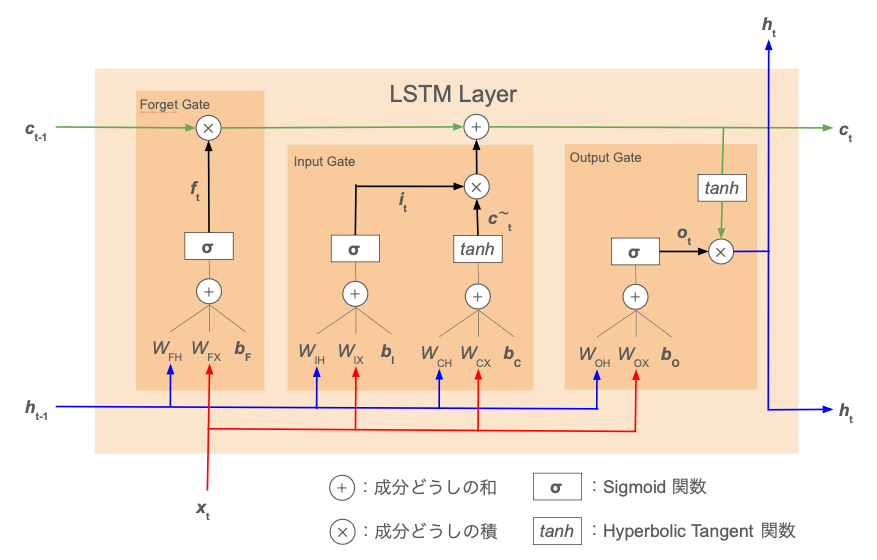
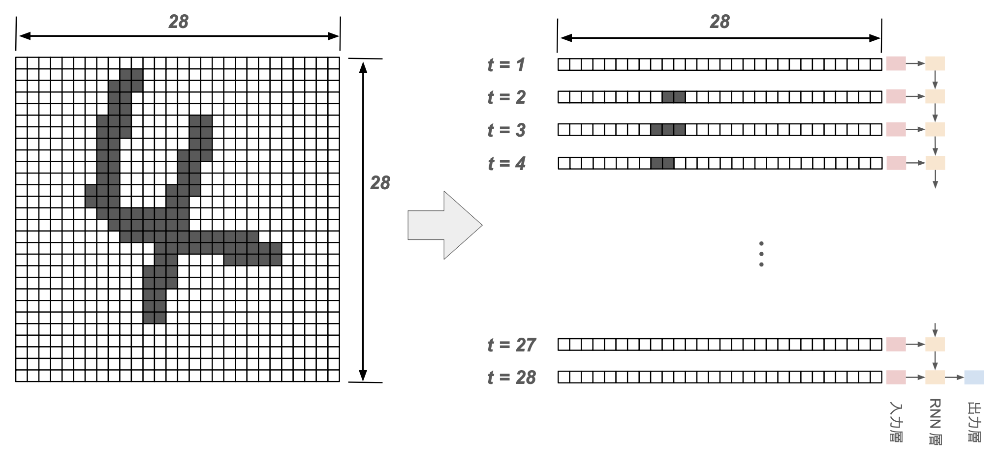
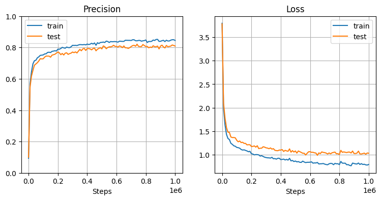

> **【NOTE】注意**
> 
> 本ノートは [MLP（多層パーセプトロン）](mlp.md)および [RNN](rnn.md) の内容を前提として記述する。

# LSTM とは

LSTM = Long Short-Term Memory

時系列データを取り扱うニューラルネットワークである [RNN](rnn.md)（再帰型ニューラルネット）の1種。  
過去の情報を長期記憶しておくための記憶セルを導入することで、シンプルな RNN の課題であった「長期記憶の消失」を少し解決したモデル。


# 概観



- $\sigma$ はシグモイド関数、$\tanh$ はハイパボリックタンジェント関数による活性化を表す
- 掛け算、足し算はそれぞれベクトルの成分ごとの計算を意味する

| ベクトル                       | 説明                                                                                                         |
| :------------------------- | :--------------------------------------------------------------------------------------------------------- |
| $\boldsymbol{x}_t$         | 前の層からの時刻 $t$ の入力                                                                                           |
| $\boldsymbol{h}_t$         | シンプルな RNN と同様、LSTM 層の出力（兼、次の時刻に渡す隠れ状態）を表すベクトル                                                              |
| $\boldsymbol{c}_t$         | **記憶セル** = LSTM 専用の状態記憶ベクトル<br>**過去の時刻すべての長期記憶**                                                           |
| $\boldsymbol{f}_t$         | 記憶セル $\boldsymbol{c}_t$ の各成分について、その時刻で忘却する度合いを表すベクトル（$0 \le f_{t,k} \le 1$）                                |
| $\boldsymbol{\tilde{c}}_t$ | 時刻 $t-1$ までの長期記憶 $\boldsymbol{c}_{t-1}$ に対して、時刻 $t$ の入力 $\boldsymbol{x}_t$ の情報を付加するためのベクトル                 |
| $\boldsymbol{i}_t$         | $\boldsymbol{\tilde{c}}_t$ の各成分に対し、記憶セルに加える前に重要度に応じて情報を取捨選択するためのベクトル（$0 \le i_{t,k} \le 1$）                |
| $\boldsymbol{o}_t$         | 長期記憶である $\boldsymbol{c}_t$ の各成分が、その時刻 $t$ の出力 $\boldsymbol{h}_t$ にとってどれだけ重要かを表すベクトル（$0 \le o_{t,k} \le 1$） |

| 処理層             | 説明                                    |
| :-------------- | :------------------------------------ |
| **Forget Gate** | 前時刻の記憶セルから情報を忘れさせる機構                  |
| **Input Gate**  | 記憶セルに新しい時刻の情報をインプットする機構               |
| **Output Gate** | 記憶セルから LSTM 層の出力（兼、次時刻に渡す隠れ状態）を生成する機構 |

シンプルな RNN では下図のように、長期的な記憶を保持するために隠れ状態 $\boldsymbol{h}_t$ を利用していた。この方法では、誤差の逆伝播において、時間ステップごとに活性化関数 $\phi_R$ を通ることになる。  
RNN で用いられる一般的な活性化関数であるハイパボリックタンジェント関数を使うと、活性化関数の微分の値域が $0 \lt \partial \phi_R(z) / \partial z \le 1$ となるため、勾配は時間ステップを遡るたびに小さくなっていってしまう（→ 勾配消失）。

一方、LSTM の長期記憶 $\boldsymbol{c}_t$ のフロー（上図の緑矢印）に注目すると、時間ステップを進めても、ベクトルの成分同士の積と和の計算しか登場しないことが分かる。したがって、（長期的に重要な情報に関しては）勾配が消失しにくいことが期待できる。

（参考）シンプルな RNN：


（参考）活性化関数とその微分の値域：


# LSTM 層の処理

## Forget Gate


前時刻の記憶セル $\boldsymbol{c}_{t-1}$ から、不要な記憶を忘れさせる機構。  
「$\boldsymbol{c}_{t-1}$ の各成分をどれだけ忘れずに残すか」を表すベクトル

$$
\boldsymbol{f}_t := \sigma \left(
    W_{FX}\ \boldsymbol{x}_t +
    W_{FH}\ \boldsymbol{h}_{t-1} +
    \boldsymbol{b}_F
\right)
$$

を求め、アダマール積 $\boldsymbol{f}_t \odot \boldsymbol{c}_{t-1}$ を計算することで $\boldsymbol{c}_{t-1}$ から情報を忘れさせる。

ここで、$\sigma(\cdots)$ はシグモイド関数を表す。  
$\boldsymbol{f}_t$ は残したい記憶の程度であるから、全結合の結果にシグモイド関数を適用することで値が $0 \le f_{t,k} \le 1$ の範囲内におさまるようにしている。

→ $\boldsymbol{f}_t$ によって記憶セルの符号が変わったり、値が大きくブーストされたりといったことは起こらない


## Input Gate


新しく覚えるべき情報を記憶セルに追加する機構。

まず前層からの時刻 $t$ の入力である $\boldsymbol{x}_t$ と前時刻の隠れ状態 $\boldsymbol{h}_{t-1}$ から、記憶セルに追加したい情報

$$
\boldsymbol{\tilde{c}}_t := \tanh \left(
    W_{CX}\ \boldsymbol{x}_t +
    W_{CH}\ \boldsymbol{h}_{t-1} +
    \boldsymbol{b}_C
\right)
$$

を計算する。これに対し、$\boldsymbol{\tilde{c}}_t$ の各成分がどれほど記憶セルにとって重要かを表す

$$
\boldsymbol{i}_t := \sigma \left(
    W_{IX}\ \boldsymbol{x}_t +
    W_{IH}\ \boldsymbol{h}_{t-1} +
    \boldsymbol{b}_I
\right)
$$

も計算し、$\boldsymbol{\tilde{c}}_t$ とのアダマール積 $\boldsymbol{i}_t \odot \boldsymbol{\tilde{c}}_t$ を取ることで記憶セルに加えるべき情報を取捨選択する。

Forget Gate の $\boldsymbol{f}_t$ と同様に $\boldsymbol{i}_t$ についても、全結合の結果にシグモイド関数を適用することで、$\boldsymbol{\tilde{c}}_t$ の情報を取捨選択するためのフィルタとして $0\le i_{t,k}\le 1$ となるようにしてある。

以上の Forget Gate および Input Gate の処理により、時刻 $t$ の記憶セル

$$
\boldsymbol{c}_t = \boldsymbol{f}_t \odot \boldsymbol{c}_{t-1} + \boldsymbol{i}_t \odot \boldsymbol{\tilde{c}}_t
$$

が計算できる。


## Output Gate


セル状態 $\boldsymbol{c}_t$ から、その時刻 $t$ における出力 $\boldsymbol{h}_t$ を計算する機構。

「長期記憶を表す $\boldsymbol{c}_t$ の各成分が、特定時刻 $t$ の出力 $\boldsymbol{h}_t$ にとってどれだけ重要か」を表すベクトル

$$
\boldsymbol{o}_t := \sigma \left(
    W_{OX}\ \boldsymbol{x}_t +
    W_{OH}\ \boldsymbol{h}_{t-1} +
    \boldsymbol{b}_O
\right)
$$

を計算し、$\boldsymbol{c}_t$（のハイパボリックタンジェント）とのアダマール積をとることで出力 $\boldsymbol{h}_t$ を計算する：

$$
\boldsymbol{h}_t = \boldsymbol{o}_t \odot \tanh{\boldsymbol{c}_t}
$$

ここまでの $\boldsymbol{f}_t, \boldsymbol{i}_t$ と同様、$\boldsymbol{o}_t$ についてもシグモイド関数の性質から $0\le o_{t,k} \le 1$ となり、重要度を示すフィルタとして都合の良い値の範囲に変換されている。


# 実装・動作確認

## コード

### MLP と共通のクラス

全結合層：



活性化関数：



SoftMax 関数：



損失関数（Cross-Entropy Loss）：



Batch Normalization：



Dropout：




### LSTM 独自のクラス




### 時系列データの分類器




## 動作確認

### 時系列ラベリング：MNIST 手書き数字画像

[RNN](rnn.md) の動作確認と同様に、MNIST の手書き数字画像データ（$28\times 28$ ピクセル）を読み込み、
- 各時刻の入力の特徴量が28個（28次元ベクトル）
- 時系列長が28

の時系列データと見なして、many to one の分類問題を解く。



学習データ生成：



```python
# MNIST データ読み込み
X, Y = MnistClassificationData().rnn(10000)
X_test, Y_test = X[:1000], Y[:1000]
X_train, Y_train = X[1000:10000], Y[1000:10000]
```

モデル初期化・学習：

```python
# モデル学習
model_lstm = LSTMClassifier(X_train, Y_train, X_test, Y_test,
    H_rnn=10, L_rnn=1, H_mlp=20, L_mlp=1)
model_lstm.train(epoch=1000, mini_batch=10, eta=0.001, log_interval=5)

# 学習曲線を描画
plt.figure(figsize=(9, 4))
plt.subplots_adjust(wspace=0.2, hspace=0.4)
plt.subplot(1, 2, 1)
model_lstm.plot_accuracy()
plt.subplot(1, 2, 2)
model_lstm.plot_loss()
plt.show()
```



他のハイパーパラメータはそのままで、LSTM 層を2層に増やしてみる（`L_rnn=2`）：


