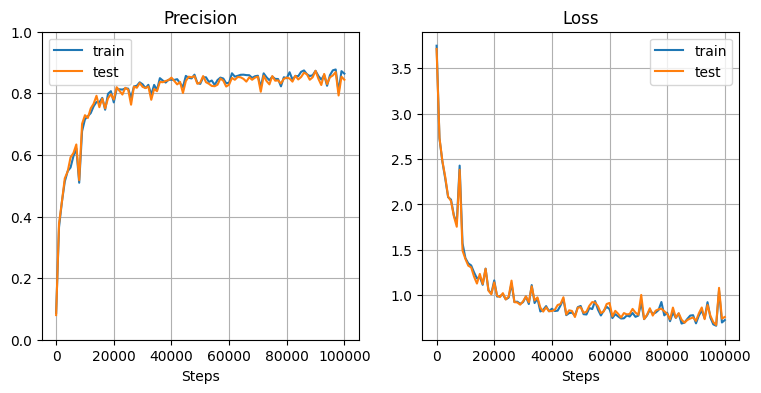

> **【NOTE】注意**
> 
> 本ノートは [MLP（多層パーセプトロン）](mlp.md)の内容を前提として記述する。

# RNN とは

RNN = Recurrent Neural Network

自然言語処理や音声信号など、時系列データ処理の分野で高い性能を発揮するニューラルネットワークの1種。


# 概観

下図に RNN の概観を示す。  
ここでは、各時刻のデータ $\boldsymbol{x}_1,\cdots,\boldsymbol{x}_t$ ごとに対応する出力値 $\boldsymbol{y}_1,\cdots,\boldsymbol{y}_t$ を得る系列ラベリングの問題を想定する。  
（例：文章データの単語ごとの品詞分類）


| 処理層       | 説明                                                                                                                                                                                                                       |
| :-------- | :----------------------------------------------------------------------------------------------------------------------------------------------------------------------------------------------------------------------- |
| **入力層**   | [MLP（多層パーセプトロン）](mlp.md)を参照                                                                                                                                                                                              |
| **出力層**   | [MLP（多層パーセプトロン）](mlp.md)を参照                                                                                                                                                                                              |
| **全結合層**  | [MLP（多層パーセプトロン）](mlp.md)を参照                                                                                                                                                                                              |
| **活性化層**  | [MLP（多層パーセプトロン）](mlp.md)を参照                                                                                                                                                                                              |
| **RNN 層** | ・時刻 $t$ の入力データ $\boldsymbol{x}_t$ と重み行列 $W_{RX}$ の積<br>・1つ前の時刻 $t-1$ の RNN 層の出力（= **隠れ状態**）$\boldsymbol{h}_{t-1}$ と重み行列 $W_{RH}$ の積<br>・バイアス $\boldsymbol{b}_R$<br>の和を取った後に活性化関数を適用し、時刻 $t$ の隠れ状態 $\boldsymbol{h}_t$ を計算 |

※ RNN 層・出力層それぞれについて、重み $W_{RH},W_{RX},W_O$、バイアス $\boldsymbol{b}_R,\boldsymbol{b}_O$ は時刻によらず共通のパラメータ

時刻 $t$ の RNN 層にて、その時刻のデータだけでなく前時刻 $t-1$ の隠れ状態 $\boldsymbol{h}_{t-1}$ も入力に加えることで、**過去の時系列情報をモデルに含めることができる**。  
前時刻 $t-1$ の RNN 層でも同様に時刻 $t-2$ の隠れ状態 $\boldsymbol{h}_{t-2}$ を入力としているので、$\boldsymbol{h}_{t-1}$ には時刻 $t-2$ の情報も含まれる。  
→ したがって再帰的に、**$\boldsymbol{h}_t$ はそれ以前の時刻 $1, 2, \cdots, t-1, t$ の情報を含むことになる**。

同様に、時系列 $\boldsymbol{x}_1,\cdots,\boldsymbol{x}_t$ に対して1つの出力 $\boldsymbol{y}$ を得る問題の場合の RNN を下図に示す。  
（例：文章全体のクラス分類）


これらも含めて、RNN のネットワークには以下のような分類がある。


- many to many
    - synced：品詞分類など
    - not synced：機械翻訳など
- many to one：文章分類など
- one to many：画像のキャプション生成

また、RNN 層と出力層の間に多層パーセプトロンの隠れ層を挟んでディープなネットワークにすることもできる：


# RNN 層の処理

## 順方向の処理

RNN 層では、その時刻 $t$ の時系列データ $\boldsymbol{x}_t$ と、1ステップ前の時刻の隠れ状態 $\boldsymbol{h}_{t-1}$ それぞれに重みをかけてバイアス $\boldsymbol{b}$ を加えて活性化関数 $\phi_R$ を適用し、過去の時系列情報を含む隠れ状態 $\boldsymbol{h}_t$ を生成する：

$$
\boldsymbol{h}_t :=
\phi_R(
    W_{RX} \boldsymbol{x}_t + W_{RH} \boldsymbol{h}_{t-1} + \boldsymbol{b}
)
\tag{1}
$$

ここで、ベクトル $\boldsymbol{h}_t,\boldsymbol{h}_{t-1}, \boldsymbol{x}_t, \boldsymbol{b}$ はすべて列ベクトルとして扱っている。

入力 $\boldsymbol{x}_t$ の次元を $N$、隠れ状態 $\boldsymbol{h}_t$ やバイアス $\boldsymbol{b}$ の次元を $H$ とすれば、
- $W_{RX}$：$H\times N$ 行列
- $W_{RH}$：$H \times H$ 行列

また、最初の時系列データ $\boldsymbol{x}_1$ を入力とするときは「1ステップ前の時刻の隠れ状態」が存在しないため、ゼロベクトルを入力としておく。


## 誤差逆伝播による学習

RNN 層の活性化層の誤差逆伝播に関しては、基本的に[多層パーセプトロン（MLP）](mlp.md)と同様のためそちらを参照。  
ただし many to many のように、活性化層の出力が次の時間ステップの RNN 層だけでなく全結合層等にも枝分かれして渡される場合、枝分かれしたそれぞれの誤差を足し合わせて逆伝播させる。


ここでは、RNN 層の全結合層について記述する。


### 入力変数

| 変数                     | 説明                                                       |
| :--------------------- | :------------------------------------------------------- |
| $\boldsymbol{x}_t$     | 時刻 $t$ の時系列データ。$N$ 次元ベクトル                                |
| $\boldsymbol{h}_{t-1}$ | 1ステップ前の時刻の RNN 層で計算した隠れ状態。$H$ 次元ベクトル                     |
| $W_{RX}$               | 時系列データ $\boldsymbol{x}_t$ にかける重み。$H\times N$ 行列          |
| $W_{RH}$               | 1ステップ前の隠れ状態 $\boldsymbol{h}_{t-1}$ にかける重み。$H\times H$ 行列 |
| $\boldsymbol{b}$       | バイアス項。$H$ 次元ベクトル                                         |

### 出力変数

$$
\begin{eqnarray}
    \boldsymbol{z} &:=& W_{RX} \boldsymbol{x}_t + W_{RH} \boldsymbol{h}_{t-1} + \boldsymbol{b}
    \\
    z_i &=& \sum_j W_{RX,ij} x_{t,j} + \sum_j W_{RH,ij} h_{t-1,j} + b_i
\end{eqnarray}
\tag{2}
$$

### コスト関数の勾配

$(2)$ 式より、

$$
\begin{eqnarray}
    \cfrac{\partial z_i}{\partial x_{t,j}} &=& W_{RX,ij}
    \\
    \cfrac{\partial z_i}{\partial h_{t-1,j}} &=& W_{RH,ij}
    \\
    \cfrac{\partial z_i}{\partial W_{RX,kl}} &=& \delta_{ik} x_{t,l}
    \\
    \cfrac{\partial z_i}{\partial W_{RH,kl}} &=& \delta_{ik} h_{t-1,l}
    \\
    \cfrac{\partial z_i}{\partial b_j} &=& \delta_{ij}
\end{eqnarray}
$$

ここで、$\delta_{ik}$ はクロネッカーのデルタ（$i=k$ のときのみ1、それ以外は0）。

ゆえに、コスト関数 $J$ の勾配は

$$
\begin{eqnarray}
    \cfrac{\partial J}{\partial x_{t,i}}
    &=&
    \sum_j \cfrac{\partial J}{\partial z_j}\cfrac{\partial z_j}{\partial x_{t,i}}
    =
    \sum_j \cfrac{\partial J}{\partial z_j} W_{RX,ji}
    =
    \sum_j W_{RX,ij}^T \cfrac{\partial J}{\partial z_j}
    =
    \left( W_{RX}^T \cfrac{\partial J}{\partial \boldsymbol{z}} \right)_i
    \\
    \cfrac{\partial J}{\partial h_{t-1,i}}
    &=&
    \sum_j \cfrac{\partial J}{\partial z_j}\cfrac{\partial z_j}{\partial h_{t-1,i}}
    =
    \sum_j \cfrac{\partial J}{\partial z_j} W_{RH,ji}
    =
    \sum_j W_{RH,ij}^T \cfrac{\partial J}{\partial z_j}
    =
    \left( W_{RH}^T \cfrac{\partial J}{\partial \boldsymbol{z}} \right)_i
    \\
    \cfrac{\partial J}{\partial W_{RX,kl}}
    &=&
    \sum_j \cfrac{\partial J}{\partial z_j}\cfrac{\partial z_j}{\partial W_{RX,kl}}
    =
    \sum_j \cfrac{\partial J}{\partial z_j} \delta_{jk} x_{t,l}
    =
    \cfrac{\partial J}{\partial z_k} x_{t,l}
    =
    \left( \cfrac{\partial J}{\partial \boldsymbol{z}} \boldsymbol{x}_t^T \right)_{kl}
    \\
    \cfrac{\partial J}{\partial W_{HX,kl}}
    &=&
    \sum_j \cfrac{\partial J}{\partial z_j}\cfrac{\partial z_j}{\partial W_{HX,kl}}
    =
    \sum_j \cfrac{\partial J}{\partial z_j} \delta_{jk} h_{t-1,l}
    =
    \cfrac{\partial J}{\partial z_k} h_{t-1,l}
    =
    \left( \cfrac{\partial J}{\partial \boldsymbol{z}} \boldsymbol{h}_{t-1}^T \right)_{kl}
    \\
    \cfrac{\partial J}{\partial b_i} &=& \sum_j \cfrac{\partial J}{\partial z_j} \cfrac{\partial z_j}{\partial b_i}
    = \sum_j \cfrac{\partial J}{\partial z_i} \delta_{ji}
    = \cfrac{\partial J}{\partial z_i}
    = \left( \cfrac{\partial J}{\partial \boldsymbol{z}} \right)_i
\end{eqnarray}
$$


# 効率を高める工夫

## Layer Normalization

[多層パーセプトロン（MLP）](mlp.md)において、**各特徴量ごとにミニバッチ間で** 平均・標準偏差を計算してデータを標準化する Batch Normalization という技術について言及した。

**Layer Normalization** では、**特徴量間で** 平均・標準偏差を計算してデータを標準化する。

### 入力変数

| 変数                    | 説明                                        |
| :-------------------- | :---------------------------------------- |
| $\boldsymbol{x}$      | 前層の出力。ミニバッチ学習の場合は、そのうちの1つのデータサンプル         |
| $N_f$                 | $\boldsymbol{x}$ の次元（特徴量次元）               |
| $\boldsymbol{\gamma}$ | $\boldsymbol{x}$ と同じ $N_f$ 次元の調整用変数（重み）   |
| $\boldsymbol{\beta}$  | $\boldsymbol{x}$ と同じ $N_f$ 次元の調整用変数（バイアス） |


### 中間変数

| 変数                     | 説明                                        |
| :--------------------- | :---------------------------------------- |
| $\mu$                  | $\boldsymbol{x}$ の特徴量の値の平均                |
| $\sigma$               | $\boldsymbol{x}$ の特徴量の値の標準偏差              |
| $\hat{\boldsymbol{x}}$ | $\boldsymbol{x}$ を $\mu, \sigma$ で標準化したもの |


$$
\begin{eqnarray}
    \mu &:=& \cfrac{1}{N_f} \displaystyle \sum_k x_k
    \\
    \sigma^2 &:=& \cfrac{1}{N_f} \displaystyle \sum_k \left( x_k - \mu \right)^2
    \\
    \hat{\boldsymbol{x}} &:=& \cfrac{\boldsymbol{x} - \mu}{\sqrt{\sigma^2 + \varepsilon}}
\end{eqnarray}
$$

※ ベクトルの2乗は各成分を2乗している（アダマール積）  
※ $\varepsilon$ は $10^{-14}$ などゼロ除算を防ぐための非常に小さい正の数


### 出力変数

$$
\begin{eqnarray}
    \boldsymbol{z} &:=& \boldsymbol{\gamma} \odot \hat{\boldsymbol{x}} + \boldsymbol{\beta}
    \\
    z_i &:=& \gamma_i x_i + \beta_i
\end{eqnarray}
$$

ここで、$\odot$ は同じ成分同士の積を取るアダマール積を表す。


### 勾配の導出

$$
\begin{eqnarray}
    \cfrac{\partial \mu}{\partial x_i} &=& \cfrac{1}{N_f}
    \\
    \cfrac{\partial \sigma^2}{\partial x_i} &=& \cfrac{2}{N_f} \left( x_i - \mu \right)
\end{eqnarray}
$$

と定義式から計算できるから、

$$
\begin{eqnarray}
    \cfrac{\partial \hat{x}_k}{\partial x_i}
    &=&
    \cfrac{1}{\sqrt{\sigma^2 + \varepsilon}} \delta_{ki} -
    \cfrac{\partial \mu}{\partial x_i} \cfrac{1}{\sqrt{\sigma^2 + \varepsilon}} -
    \cfrac{\partial \sigma^2}{\partial x_i} \cfrac{x_k - \mu}{2 \left( \sqrt{\sigma^2 + \varepsilon} \right)^3}
    \\ &=&
    \cfrac{1}{\sqrt{\sigma^2 + \varepsilon}} \delta_{ki} -
    \cfrac{1}{N_f} \cfrac{1}{\sqrt{\sigma^2 + \varepsilon}} -
    \cfrac{2}{N_f} (x_i - \mu) \cfrac{x_k - \mu}{2\left( \sqrt{\sigma^2 + \varepsilon} \right)^3}
    \\ &=&
    \cfrac{1}{\sqrt{\sigma^2 + \varepsilon}}
    \left\{
        \delta_{ki} -
        \cfrac{1}{N_f} -
        \cfrac{1}{N_f}
        \cfrac{x_i - \mu}{\sqrt{\sigma^2 + \varepsilon}}
        \cfrac{x_k - \mu}{\sqrt{\sigma^2 + \varepsilon}}
    \right\}
    \\ &=&
    \cfrac{1}{\sqrt{\sigma^2 + \varepsilon}}
    \left(
        \delta_{ki} -
        \cfrac{1}{N_f} -
        \cfrac{1}{N_f} \hat{x}_i \hat{x}_k
    \right)
\end{eqnarray}
$$

よって

$$
\begin{eqnarray}
    \cfrac{\partial J}{\partial \gamma_i}
    &=&
    \displaystyle \sum_k \cfrac{\partial J}{\partial z_k} \cfrac{\partial z_k}{\partial \gamma_i}
    = \displaystyle \sum_k \cfrac{\partial J}{\partial z_k} \delta_{ki} \hat{x}_i
    = \cfrac{\partial J}{\partial z_i} \hat{x}_i
    = \left( \cfrac{\partial J}{\partial \boldsymbol{z}} \odot \boldsymbol{\hat{x}} \right)_i
    \\ \\
    \cfrac{\partial J}{\partial \beta_i}
    &=&
    \displaystyle \sum_k \cfrac{\partial J}{\partial z_k} \cfrac{\partial z_k}{\partial \beta_i}
    = \displaystyle \sum_k \cfrac{\partial J}{\partial z_k} \delta_{ki}
    = \cfrac{\partial J}{\partial z_i}
    \\ \\
    \cfrac{\partial J}{\partial x_i}
    &=& \sum_k \cfrac{\partial J}{\partial z_k} \cfrac{\partial z_k}{\partial x_i}
    = \sum_k \cfrac{\partial J}{\partial z_k}
    \gamma_k
    \cfrac{\partial \hat{x}_k}{\partial x_i}
    \\ &=&
    \sum_k \cfrac{\partial J}{\partial z_k} \gamma_k
    \cfrac{1}{\sqrt{\sigma^2 + \varepsilon}}
    \left(
        \delta_{ki} -
        \cfrac{1}{N_f} -
        \cfrac{1}{N_f}
        \hat{x}_i \hat{x}_k
    \right)
    \\ &=&
    \cfrac{1}{\sqrt{\sigma^2 + \varepsilon}}
    \left(
        \sum_k \cfrac{\partial J}{\partial z_k} \gamma_k \delta_{ki} -
        \cfrac{1}{N_f} \sum_k \cfrac{\partial J}{\partial z_k} \gamma_k -
        \cfrac{1}{N_f} \sum_k \cfrac{\partial J}{\partial z_k} \gamma_k
        \hat{x}_i \hat{x}_k
    \right)
    \\ &=&
    \cfrac{1}{\sqrt{\sigma^2 + \varepsilon}}
    \left(
        \cfrac{\partial J}{\partial z_i} \gamma_i -
        \cfrac{1}{N_f} \sum_k \cfrac{\partial J}{\partial z_k} \gamma_k -
        \cfrac{1}{N_f} \hat{x}_i \sum_k \cfrac{\partial J}{\partial z_k} \gamma_k
        \hat{x}_k
    \right)
    \\ &=&
    \cfrac{1}{\sqrt{\sigma^2 + \varepsilon}}
    \left(
        g_i -
        \cfrac{1}{N_f} \sum_k g_k -
        \cfrac{1}{N_f} \hat{x}_i \sum_k g_k
        \hat{x}_k
    \right)
    \qquad \left( \boldsymbol{g} := \cfrac{\partial J}{\partial \boldsymbol{z}} \odot \boldsymbol{\gamma} \right)
\end{eqnarray}
$$


# 実装・動作確認

MNIST の手書き数字画像データ（$28\times 28$ ピクセル）を読み込み、
- 各時刻の入力の特徴量が28個（28次元ベクトル）
- 時系列長が28

の時系列データと見て、many to one の分類問題を解いてみる。


## コード

各層のクラス：





分類器本体：




## 動作確認

```python
X = mnist.data.to_numpy()
X = X.reshape(X.shape[0], 28, 28)
Y = np.zeros((X.shape[0], 10))
label_num = [int(l) for l in mnist.target]
for i in range(len(label_num)):
    Y[i][label_num[i]] = 1.0

# 訓練データとテストデータに分割
X_test, Y_test = X[:1000], Y[:1000]
X_train, Y_train = X[1000:10000], Y[1000:10000]
```

```python
model_rnn = RNNClassifier(X_train, Y_train, X_test, Y_test,
    n_hidden_node_rnn=10, n_hidden_node=20, n_hidden_layer=2,
    activation_func_rnn=RNNReLU)

model_rnn.train(epoch=100000, mini_batch=10, eta=0.002, log_interval=100)

# 学習曲線を描画
plt.figure(figsize=(9, 4))
plt.subplots_adjust(wspace=0.2, hspace=0.4)
plt.subplot(1, 2, 1)
model_rnn.plot_precision()
plt.subplot(1, 2, 2)
model_rnn.plot_loss()
plt.show()
```



→ 最後の隠れ状態 $h_{28}$ だけを入力とした many to one のシンプルな RNN でも、80%以上の精度で手書き数字を分類できている。


