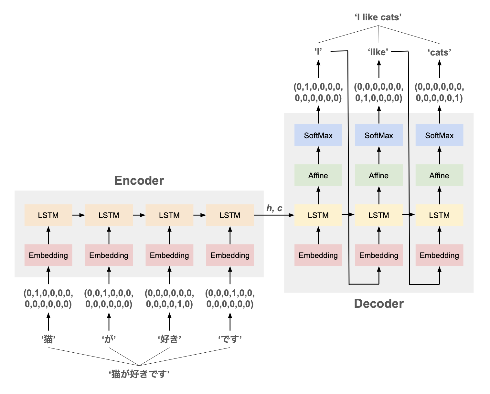
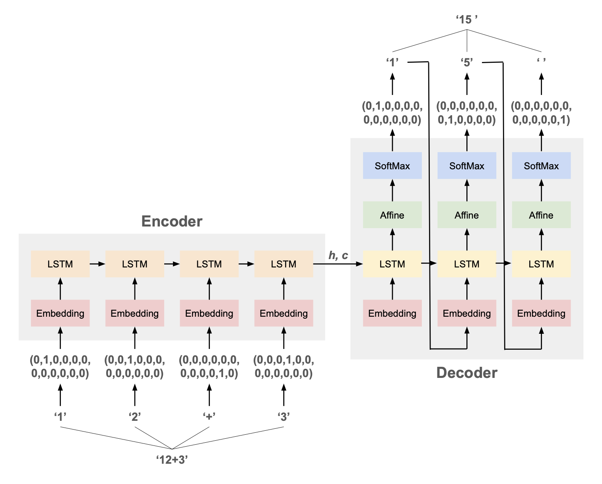
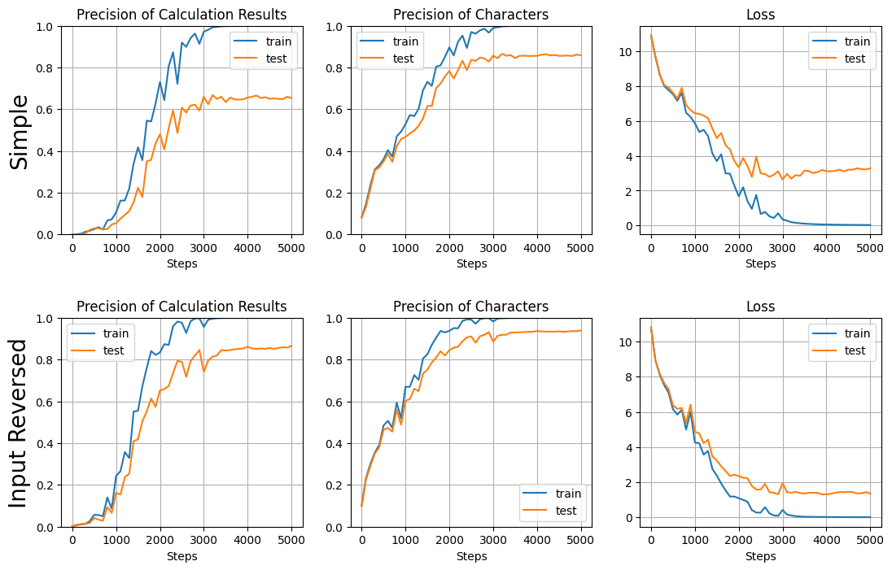
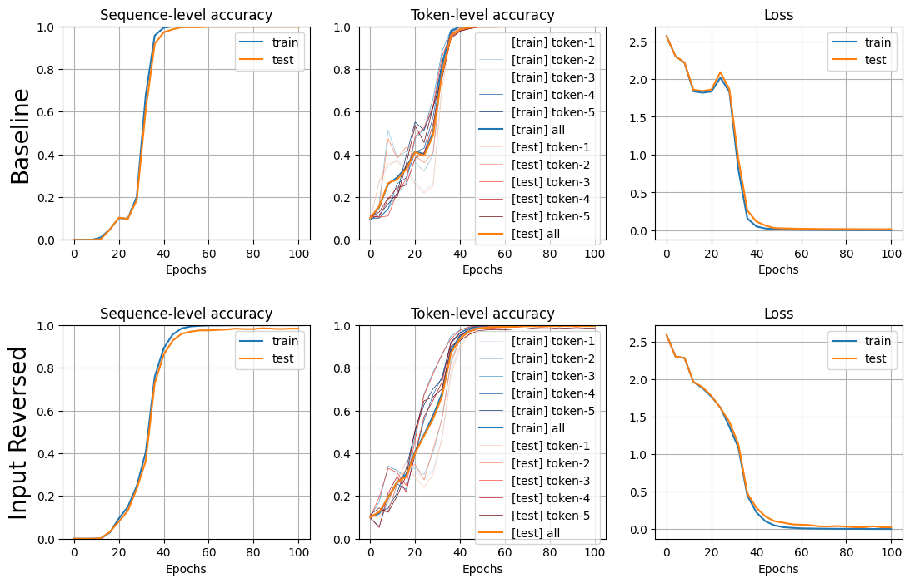

# seq2seq とは

seq2seq = sequence to sequence

時系列データを別の時系列データに変換する技術。  
ここでは [LSTM](lstm.md) を2つ用いた基本的な seq2seq について記述する。


# 概観



| 処理層         | 説明                                                        |
| :---------- | --------------------------------------------------------- |
| Embedding   | 単語をベクトルに embedding する層。[word2vec](../NLP/word2vec.md) を参照 |
| LSTM        | [LSTM](lstm.md) を参照                                       |
| Affine      | 全結合層。[MLP](mlp.md) を参照                                    |
| SoftMax     | ソフトマックス関数により全結合層の出力を各単語への所属確率に変換。[MLP](mlp.md) を参照        |
| **Encoder** | モデルに入力された時系列データを特徴ベクトルに変換                                 |
| **Decoder** | Encoder で生成された特徴ベクトルを新しい時系列データに変換                         |

- Encoder と Decoder との間で、
    - LSTM レイヤは共有しない（Encoder と Decoder で異なる LSTM を1つずつ持つ）
    - Embedding レイヤは問題に応じて共有 or 非共有
        - ex. 言語の翻訳：入力と出力で言語が異なるので Embedding は共有せず、パラメータを別にするのが良い
        - ex. 質問への回答：入力（= 質問）と同じ言語で出力（= 回答）するので Embedding は共通で良い


# 処理の流れ

**（ToDo：詳細の解説）**


# 実装・動作確認

## コード

### MLP と共通のレイヤクラス

全結合層：



活性化関数：



SoftMax 関数：



損失関数（Cross-Entropy Loss）：



Batch Normalization：



Dropout：




### seq2seq 独自のレイヤクラス

Embedding：



エンコーダ・デコーダ：




### seq2seq モデル




## 動作確認

トイデータ生成のコード：




### 足し算の計算

- 入力：`'12+3'`
- 出力：`'15'`

のように足し算の計算式とその答えの文字列を入力・出力とし、入力から出力を推論する many to many（seq2seq）の問題を解く。  
これらの計算式・数値はすべて文字列として与えられ、文字（数字・記号）1つ1つを embedding することで、それぞれの文字列を時系列データとみなす。

※ embedding の手法については [word2vec](../NLP/word2vec.md) を参照



データ生成〜モデル学習：

```python
# 訓練データ・テストデータ生成
N_train, N_test = 5000, 500
X, Y = Seq2SeqData().addition_formula(N_train + N_test)
X_train, Y_train = X[:N_train], Y[:N_train]
X_test, Y_test = X[N_train:], Y[N_train:]

# モデル初期化・学習
model = Seq2Seq(X_train, Y_train, X_test, Y_test, formula.V, H_embed=64, H_rnn=64)
model.train(epoch=400, mini_batch=100, eta=0.5, log_interval=10)
model_r = Seq2Seq(X_train, Y_train, X_test, Y_test, formula.V, H_embed=64, H_rnn=64, is_input_reversed=True)
model_r.train(epoch=400, mini_batch=100, eta=0.5, log_interval=10)

# 学習曲線を描画
plt.figure(figsize=(13, 4))
plt.subplots_adjust(wspace=0.2, hspace=0.4)
plt.subplot(1, 3, 1)
plt.ylabel('Simple', fontsize=20)
model.plot_precision_all()
plt.subplot(1, 3, 2)
model.plot_precision_char()
plt.subplot(1, 3, 3)
model.plot_loss()
plt.show()
```



- 入力文字列の左右反転を適用すると、学習速度も最終的な正解率も向上
- トークンレベルの正解率（図の中央のカラム）を見ると、1文字目 → 2文字目 → 3文字目の順に正解率が高くなっていく


### 文字列の rotate

- 入力：`'1234567'`
- 出力：`'6712345'`

のように、元の系列から決まったトークン数分だけ末尾から先頭に持ってきたものを正解として推論してみる。

```python
# 訓練データ・テストデータ生成
N_train, N_test = 5000, 500
X, Y = Seq2SeqData().rotate(N_train + N_test, L=5, shift=2)
X_train, Y_train = X[:N_train], Y[:N_train]
X_test, Y_test = X[N_train:], Y[N_train:]
# データを見てみる
for i in range(10):
    print(X[i], Y[i])

# モデル初期化・学習
model = Seq2Seq(X_train, Y_train, X_test, Y_test, formula.V, H_embed=64, H_rnn=64)
model.train(epoch=100, mini_batch=100, eta=0.5, log_interval=4)
model_r = Seq2Seq(X_train, Y_train, X_test, Y_test, formula.V, H_embed=64, H_rnn=64, is_input_reversed=True)
model_r.train(epoch=100, mini_batch=100, eta=0.5, log_interval=4)

# 学習曲線を描画
...
```

```
[0 7 7 0 0] [0 0 0 7 7]
[3 2 9 2 9] [2 9 3 2 9]
[6 1 4 9 4] [9 4 6 1 4]
[7 1 7 0 3] [0 3 7 1 7]
[4 1 2 9 9] [9 9 4 1 2]
[3 8 9 7 5] [7 5 3 8 9]
[0 8 0 4 2] [4 2 0 8 0]
[0 4 4 1 5] [1 5 0 4 4]
[8 8 0 0 1] [0 1 8 8 0]
[8 1 1 8 8] [8 8 8 1 1]
```



- 足し算よりも簡単なためか、比較的少ないステップ数で収束
- 足し算と異なり、rotate に関しては reversed を適用しても学習速度は改善しなかった


# 実験・調査

## 文字の embedding 結果の確認

前述の足し算の例において、トークン（文字）がどのようなベクトルに embedding されたかの確認のため、文字ベクトルどうしの cos 類似度をチェックしてみる：

```python
word_vec = model_r.encoder.embed.W
V, _ = word_vec.shape
cos_similarity = []
for i in range(V):
    for j in range(i+1, V):
        w1, w2 = word_vec[i], word_vec[j]
        cos = (w1*w2).sum() / np.sqrt((w1*w1).sum()) / np.sqrt((w2*w2).sum())
        cos_similarity.append((cos, formula.i2c[i], formula.i2c[j]))
for cos, c1, c2 in sorted(cos_similarity, reverse=True):
    print(f'{c1},{c2}: {cos}')
```

```python
0,1: 0.5433349395406125
8,9: 0.4385361366405015
6,7: 0.3997485765993889
1,2: 0.35611951788781293
3,4: 0.321399207056158
2,3: 0.3043434566415254
7,8: 0.2919007835311846
0,2: 0.2753794931435943
4,5: 0.20550983640696036
5,6: 0.20261078065508356

...

4,8: -0.12962096739296886
4,7: -0.130371761502911
6, : -0.13094358765168462
3,9: -0.14519820790525137
8, : -0.1582066403658733
3,7: -0.1715591386658222
3,+: -0.17168790983358764
0,6: -0.1754850652123799
1,8: -0.19272078519358443
7,+: -0.1974169972079686
```

- embedding の類似度が高い上位10件は 0,1 や 5,6 のような差が1（= 値が近い）のペアで占められている  
- 逆に類似度が低い下位では記号と数字のペアや値が遠い数字のペアが多く並ぶ
