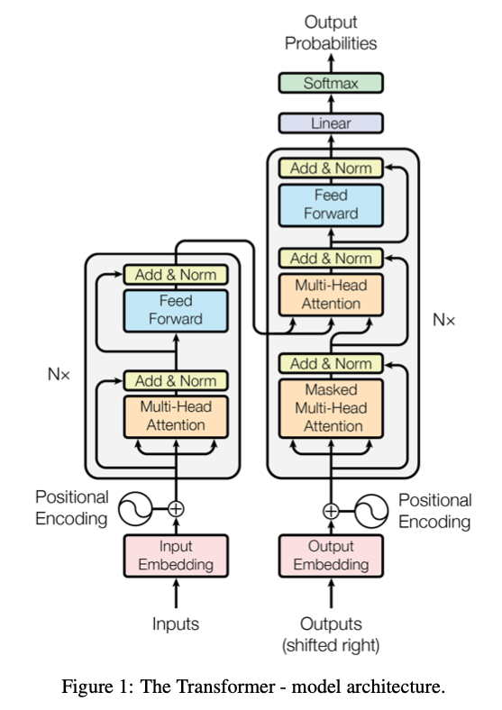
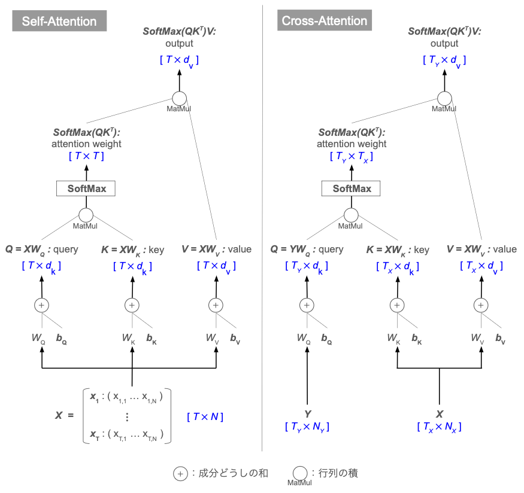
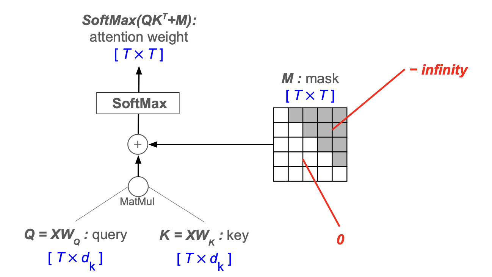
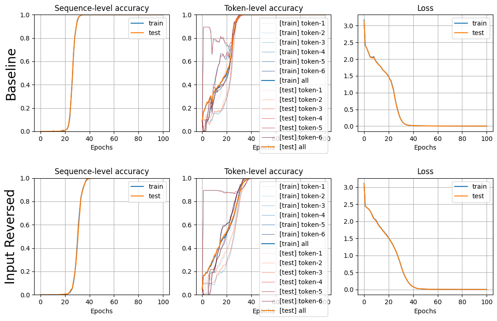
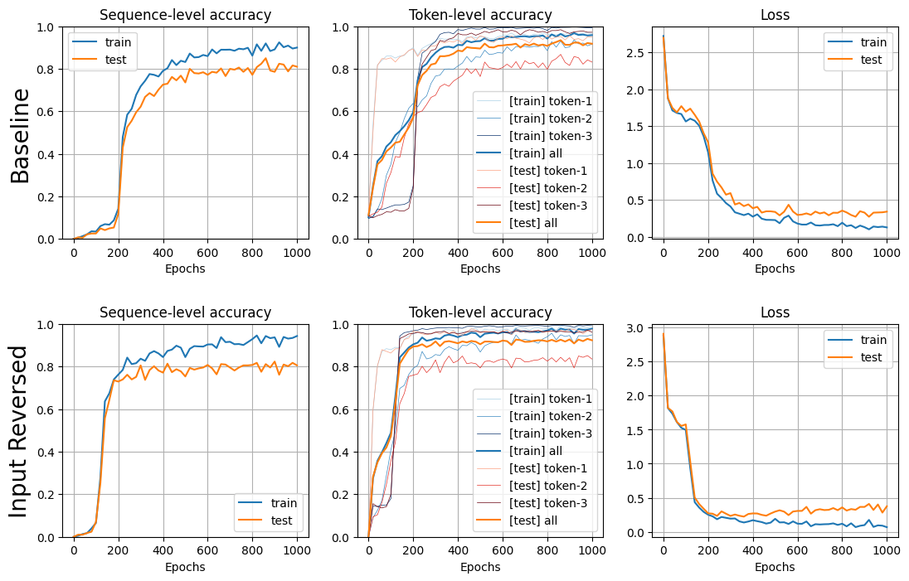

# Transformer とは

発表：**Vaswani et al., "Attention Is All You Need," 2017**

文章から文章を推論する [seq2seq](seq2seq.md) の問題を解く Encoder-Decoder モデルの1つ。

それまでの [RNN](rnn.md) や [LSTM](lstm.md) による seq2seq では、
1. ある時刻の隠れ状態 $\boldsymbol{h}_t,\boldsymbol{c}_t$ を計算
2. それを使って次の時刻の隠れ状態 $\boldsymbol{h}_{t+1}, \boldsymbol{c}_{t+1}$を計算
3. 1,2を系列の長さの分だけ繰り返す

といった処理が必要になり、この部分は直列にしか計算ができないため計算コストが大きい。

そこで、それまでの seq2seq でも RNN と組み合わせる形で利用されていた [Attention](attention.md) の技術に着目し、RNN を使わず Attention のみを用いて系列情報を取り扱う Transformer の手法が開発された。


# 概観


(Vaswani et al., "Attention Is All You Need," 2017)

| 処理層                                    | 説明                                                                                                                                             |
| :------------------------------------- | :--------------------------------------------------------------------------------------------------------------------------------------------- |
| **Input Embedding / Output Embedding** | 単語を分散表現（ベクトル）に embedding                                                                                                                       |
| **Positional Encoding**                | 系列中のどの時刻に出現したか、に応じて異なる値を加算することで、**ベクトルに時刻（出現位置）の情報を付加**                                                                                        |
| **Self-Attention**                     | Encoder 側（図の左側）の "Multi-Head Attention"。<br>**入力系列内の各要素に対して、他の全ての要素との関連性を計算し、各要素のベクトル表現を更新**<br>**= 単語（要素）単体ではなく、系列全体から俯瞰して見たときの単語のベクトル表現を計算** |
| **Masked Self-Attention**              | Decoder 側（図の右側）の "Masked Multi-Head Attention"。<br>**未来（そこより先の位置）の情報をマスクして参照しないようにした Self-Attention**                                          |
| **Cross-Attention**                    | Decoder 側（図の右側）の "Multi-Head Attention"。<br>**Encoder 側で計算した系列全ての要素と、Decoder 側の要素との関連性を計算し、Decoder 側の要素のベクトル表現を更新**                            |
| **Feed Forward**                       | 全結合層・活性化層で構成されるシンプルな MLP                                                                                                                       |
| **Add & Norm**                         | ・Add = Residual Connection, 残差接続<br>・Norm = Layer Normalization（[RNN](rnn.md) を参照）                                                             |


# 各層の処理

## Self-Attention, Cross-Attention





## Masked Self-Attention




# 実装・動作確認

## コード

Embedding：



Positional Encoding：



Layer Normalization：



Transformer のエンコーダ・デコーダ：



Transformer seq2seq モデル：



## 動作確認

単語列をそのまま出力：

```python
# 訓練データ・テストデータ生成
N_train, N_test = 5000, 500
X, Y = Seq2SeqData().addition_formula(N_train + N_test)
X_train, Y_train = X[:N_train], Y[:N_train]
X_test, Y_test = X[N_train:], Y[N_train:]

# モデル初期化・学習
model = TransformerSeq2Seq(X_train, X_train, X_test, X_test, formula.V, H_embed=32, H_qk=32, H_ff=32, is_input_reversed=False)
model.train(epoch=100, mini_batch=100, eta=0.02, log_interval=1)
model_r = TransformerSeq2Seq(X_train, X_train, X_test, X_test, formula.V, H_embed=32, H_qk=32, H_ff=32, is_input_reversed=True)
model_r.train(epoch=100, mini_batch=100, eta=0.02, log_interval=1)

# 学習曲線を描画
plt.figure(figsize=(13, 8))
plt.subplots_adjust(wspace=0.2, hspace=0.4)
plt.subplot(2, 3, 1)
plt.ylabel('Baseline', fontsize=20)
model.plot_accuracy_seq_level()
plt.subplot(2, 3, 2)
model.plot_accuracy_token_level()
plt.subplot(2, 3, 3)
model.plot_loss()
plt.subplot(2, 3, 4)
plt.ylabel('Input Reversed', fontsize=20)
model_r.plot_accuracy_seq_level()
plt.subplot(2, 3, 5)
model_r.plot_accuracy_token_level()
plt.subplot(2, 3, 6)
model_r.plot_loss()
plt.show()
```



→ 少ない epoch でほぼ100%の正解率に。最初でも最後でもなく、中途半端な4トークン目の accuracy が素早く立ち上がる理由は謎


足し算の計算：

```python
# モデル初期化・学習
model = TransformerSeq2Seq(X_train, Y_train, X_test, Y_test, formula.V, H_embed=32, H_qk=32, H_ff=32, is_input_reversed=False)
model.train(epoch=1000, mini_batch=100, eta=0.2, log_interval=20)
model_r = TransformerSeq2Seq(X_train, Y_train, X_test, Y_test, formula.V, H_embed=32, H_qk=32, H_ff=32, is_input_reversed=True)
model_r.train(epoch=1000, mini_batch=100, eta=0.2, log_interval=20)

# 学習曲線を描画
plt.figure(figsize=(13, 8))
plt.subplots_adjust(wspace=0.2, hspace=0.4)
plt.subplot(2, 3, 1)
plt.ylabel('Baseline', fontsize=20)
model.plot_accuracy_seq_level()
plt.subplot(2, 3, 2)
model.plot_accuracy_token_level()
plt.subplot(2, 3, 3)
model.plot_loss()
plt.subplot(2, 3, 4)
plt.ylabel('Input Reversed', fontsize=20)
model_r.plot_accuracy_seq_level()
plt.subplot(2, 3, 5)
model_r.plot_accuracy_token_level()
plt.subplot(2, 3, 6)
model_r.plot_loss()
plt.show()
```

